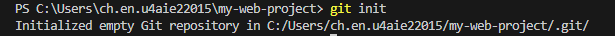
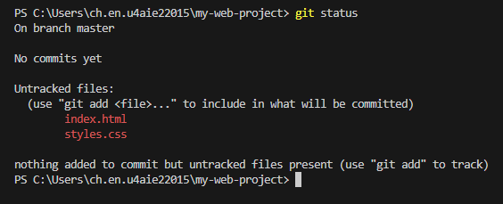
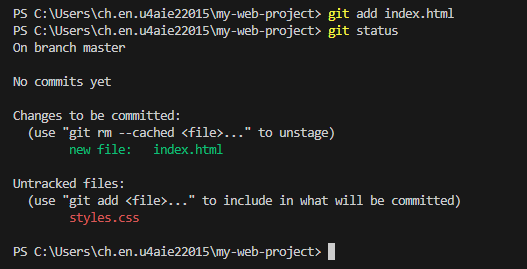
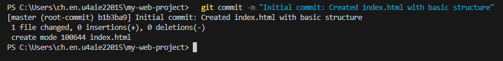
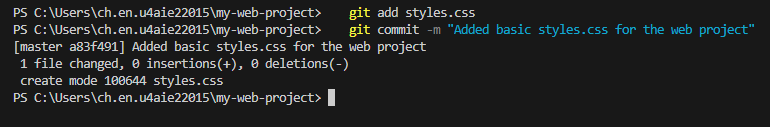
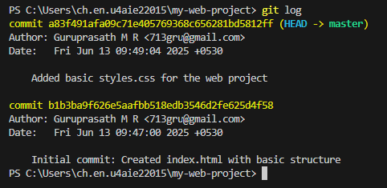
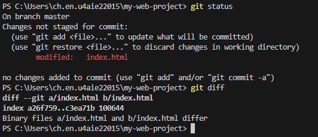
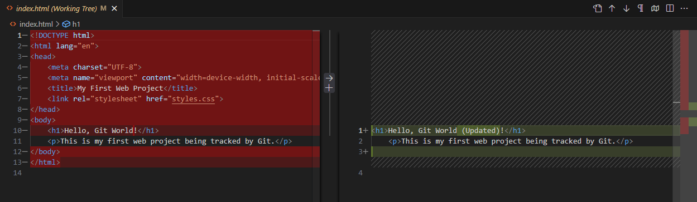
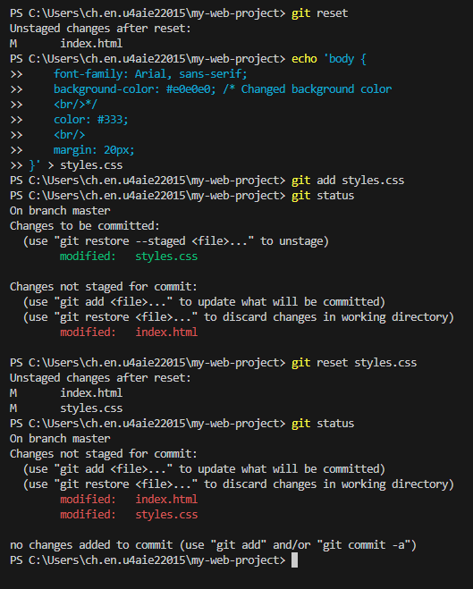

# Lab 1: Git and GitHub Tutorial – Version Control for Beginners
### 1. Aim  
<br/>

The primary aim of this lab manual is to introduce students to the fundamental concepts of Version Control Systems (VCS) using Git and to familiarize them with collaborative development workflows using GitHub. Upon completion, students will be able to manage their code versions, collaborate with others, and deploy basic projects using Git and GitHub.

### 2. Pre-requisites  
<br/>

Before starting this lab, students should have:

* Basic understanding of computer operating systems (Windows, macOS, or Linux).
* Familiarity with using a command-line interface (CLI) or terminal.

* A GitHub account (create one at [github.com](https://github.com/ "null") if you don't have one).

### 3. Theory  
<br/>

#### 3.1. What is Version Control?  
<br/>

Version control is a system that records changes to a file or set of files over time so that you can recall specific versions later. It allows multiple people to work on the same project simultaneously without overwriting each other's changes. Key benefits include:

* **Collaboration:** Multiple developers can work on the same codebase efficiently.
* **Tracking Changes:** Every change is recorded, including who made it, when, and why.
* **Reverting to Previous Versions:** Easily revert to any previous state of your project.
* **Branching and Merging:** Create separate lines of development (branches) for new features or bug fixes, then integrate them back into the main codebase.

<br/>
 
#### 3.2. Git: A Distributed Version Control System (DVCS)  
<br/>

Git is a free and open-source distributed version control system designed to handle everything from small to very large projects with speed and efficiency. In a DVCS, every developer has a complete copy of the repository, including its full history. This means:

* **Offline Work:** Developers can commit changes locally without an internet connection.
* **Resilience:** No single point of failure; if the central server goes down, development can continue.
* **Speed:** Most operations are performed locally, making them faster.

<br/>
 
#### 3.3. GitHub: A Web-based Hosting Service for Git Repositories  
<br/>
GitHub is a web-based platform that provides hosting for Git repositories. It offers all the distributed version control and source code management (SCM) functionality of Git plus its own features for collaboration, project management, and code review. It acts as a central hub where developers can:

* Store and share their Git repositories.
* Collaborate on projects using features like pull requests, issues, and wikis.
* Showcase their work and contribute to open-source projects.

<br/>
 
#### 3.4. Key Git Concepts and Terminology  
<br/>

* **Repository (Repo):** A directory containing all the project files and the entire history of changes.
* **Commit:** A snapshot of your repository at a specific point in time. Each commit has a unique ID (SHA-1 hash), a message, an author, and a timestamp.
* **Branch:** A lightweight movable pointer to a commit. Branches allow you to develop features independently without affecting the main codebase.
* **Master/Main:** The default branch in a Git repository, typically representing the stable version of the project.
* **Head:** A pointer to the current branch.
* **Working Directory:** The actual files you see and edit on your local machine.
* **Staging Area (Index):** An intermediate area where you prepare changes before committing them. You add files to the staging area with `git add`.
* **Clone:** To create a local copy of a remote repository.
* **Push:** To upload your local commits to a remote repository (e.g., GitHub).
* **Pull:** To download changes from a remote repository and merge them into your local branch.
* **Fetch:** To download changes from a remote repository without merging them.
* **Merge:** To integrate changes from one branch into another.
* **Pull Request (PR):** A feature on GitHub (and similar platforms) to propose changes and ask for them to be reviewed and merged into a target branch.

<br/>
 
### 4. Procedure  


#### 4.1. Installation of Git  

1. **Windows:**

   * Download the Git installer from [git-scm.com/download/win](https://git-scm.com/download/win "null").
   * Run the installer and follow the default prompts. It's recommended to choose "Use Git from the Windows Command Prompt" during installation.
2. **macOS:**

   * **Homebrew (Recommended):** Open Terminal and run: `brew install git`
   * **Direct Installer:** Download from [git-scm.com/download/mac](https://git-scm.com/download/mac "null").
3. **Linux (Debian/Ubuntu):** Open Terminal and run: `sudo apt update && sudo apt install git`
4. **Verify Installation:** Open your terminal/command prompt and type: `git --version`

   * You should see the installed Git version.

<br/>

#### 4.2. Basic Git Configuration  

Before making any commits, configure your Git username and email. These will be associated with your commits.

1. Open your terminal/command prompt.
2. Set your username:

   ```
   git config --global user.name "Guruprasath M R"
   ```
3. Set your email:

   ```
   git config --global user.email "713gru@gmail.com"
   ```
4. Verify configuration:

   ```
   git config --list
   ```

<br/>

#### 4.3. Creating Your First Local Git Project and Committing Changes

This section walks you through initializing a Git repository, creating files, and making your first commits.

1. **Create a new project directory:**

   * For this lab, let's create a directory for a simple web project.

   ```
   mkdir my-web-project
   cd my-web-project
   ```

   * *Observation:* You are now inside the `my-web-project` directory.
2. **Initialize Git in the directory:** This creates a hidden `.git` directory which stores all the repository's history and metadata.

   ```
   git init
   ```

   * *Observation:* You should see a message indicating an empty Git repository has been initialized.
   * *Self-reflection:* At this point, your directory becomes a Git repository.
     
     

3. **Understanding Git's Three States:** Git primarily operates with three main states for your files:

   * **Working Directory:** This is where you actually modify files. These are the files you see in your project folder.
   * **Staging Area (Index):** This is an intermediate area where you prepare changes before committing them. You explicitly add files here using `git add`.
   * **Git Repository (Local):** This is where Git stores all your committed history. Once changes are committed, they are permanently recorded in the `.git` directory.
4. **Create your initial project files:**

   * Create an `index.html` file with a basic HTML structure.

   ```
   echo '<!DOCTYPE html>
   <html lang="en">
   <head>
       <meta charset="UTF-8">
       <meta name="viewport" content="width=device-width, initial-scale=1.0">
       <title>My First Web Project</title>
       <link rel="stylesheet" href="styles.css">
   </head>
   <body>
       <h1>Hello, Git World!</h1>
       <p>This is my first web project being tracked by Git.</p>
   </body>
   </html>' > index.html

   ```

   * Create a `styles.css` file with some basic styling.

   ```
   echo 'body {
       font-family: Arial, sans-serif;
       background-color: #f0f0f0;  
       <br/>
       color: #333;  
       <br/>
       margin: 20px;
   }' > styles.css

   ```

   * *Observation:* You now have two new files in your `my-web-project` directory.
5. **Check the status of your repository :** This command shows you the current state of your working directory and staging area, indicating which files are untracked, modified, or staged.

   ```
   git status
   ```

   * *Observation:* You should see `index.html` and `styles.css` listed under "Untracked files." This means Git sees them but isn't currently tracking their changes.

   

6. **Stage the files :** Add `index.html` to the staging area. This prepares the file to be included in the next commit.

   ```
   git add index.html
   ```

   * *Observation:* Run `git status` again. `index.html` should now be under "Changes to be committed," indicating it's in the staging area. `styles.css` remains untracked.
   * *Explanation:* You can stage files individually or all at once. `git add .` stages all new and modified files in the current directory and its subdirectories.



7. **Commit the staged changes :** This saves the snapshot of your staged changes to your repository history. The `-m` flag provides a concise commit message.

   ```
   git commit -m "Initial commit: Created index.html with basic structure"
   ```

   * *Observation:* You'll see output confirming the commit, including the commit hash and the number of files changed.



8. **Stage and Commit:**

   ```
   git add styles.css
   git commit -m "Added basic styles.css for the web project"
   ```

   * *Observation:* Now both `index.html` and `styles.css` are part of your repository's history.

   

9. **View commit history :** This command shows a list of all commits in the current branch, from newest to oldest.

   ```
   git log
   ```

   * *Observation:* You should see your two commits listed, each with a unique hash, author, date, and commit message.

   

10. **Viewing Unstaged Changes :**

    * Make a small change to `index.html` (e.g., change the `<h1>` tag content).

    ```
    echo '<h1>Hello, Git World (Updated)!</h1>
    <p>This is my first web project being tracked by Git.</p>
    ' > index.html
    ```

    * Use `git status` to see it's modified.
    * Use `git diff` to see the exact changes that are not yet staged:

    ```
    git diff
    ```

    * *Observation:* `git diff` will show you the line-by-line differences between your working directory and the staging area (or last commit if nothing is staged). Lines removed are prefixed with `-`, and lines added with `+`.




11. **Unstaging Files :**

    * If you accidentally staged a file and want to remove it from the staging area *before* committing, you can use `git reset`.
    * First, modify `styles.css` (e.g., change background color).

    ```
    echo 'body {
        font-family: Arial, sans-serif;
        background-color: #e0e0e0; /* Changed background color   
        <br/>*/
        color: #333;  
        <br/>
        margin: 20px;
    }' > styles.css

    ```

    * Stage it: `git add styles.css`
    * Check status: `git status` (it's now "Changes to be committed").
    * Unstage it: `git reset HEAD styles.css` (or simply `git reset styles.css` in newer Git versions).
    * Check status: `git status` (it's now "Changes not staged for commit"). The changes are still in your working directory, just no longer prepared for the next commit.



12. **Removing Tracked Files :**

    * If you want to delete a file and also remove it from Git's tracking, use `git rm`.
    * Create a dummy file: `echo "dummy content" > temp.txt`
    * Add and commit it: `git add temp.txt && git commit -m "Add temp.txt"`
    * Now remove it using `git rm`:

    ```
    git rm temp.txt

    ```

    * *Observation:* The file `temp.txt` is removed from your working directory, and `git status` will show it as deleted and staged for commit.
    * Commit the removal: `git commit -m "Removed temp.txt"`

#### 4.4. Connecting to GitHub (Remote Repository) and Pushing   
<br/>Your First Project

Now that you have a local Git repository with some commits, let's connect it to GitHub.

1. **Create a new repository on GitHub:**

   * Go to [github.com](https://github.com/ "null").
   * Click on the "New" repository button (or the `+` sign -> "New repository").
   * Give it a name that matches your local project (e.g., `my-web-project`).
   * Keep it Public or Private as per your preference.
   * **IMPORTANT:** **DO NOT** check "Add a README file", "Add .gitignore", or "Choose a license" as we already have local files and history.
   * Click "Create repository".
2. **Copy the remote repository URL:** After creating, GitHub will show you instructions to link an existing repository. Copy the HTTPS URL (e.g., `https://github.com/your-username/my-web-project.git`).
3. **Add the remote origin to your local repository:** This command tells your local Git repository where its remote counterpart is located.

   ```
   git remote add origin https://github.com/your-username/my-web-project.git

   ```

   * Replace `your-username` with your actual GitHub username.
   * *Observation:* You can verify the remote was added by typing `git remote -v`.
4. **Rename the default branch to 'main' (optional but recommended):** Historically, the default branch name in Git was `master`. Modern Git and GitHub prefer `main` for inclusivity. This command renames your local `master` branch (if it exists) to `main`.

   ```
   git branch -M main

   ```
5. **Push your local repository to GitHub:** This uploads all your local commits from the `main` branch to the `origin` remote.

   ```
   git push -u origin main

   ```

   * The `-u` flag sets the upstream (tracking) branch, so subsequent `git push` and `git pull` commands will know which remote branch to interact with.
   * *Authentication:* You might be prompted to enter your GitHub username and Personal Access Token (PAT). If you haven't set up PAT, you'll need to create one on GitHub under Developer Settings -> Personal access tokens. Using PAT is more secure than using your password directly.
   * *Observation:* After a successful push, refresh your GitHub repository page. You should now see `index.html` and `styles.css` (and any other files you committed) displayed. Your entire commit history is now on GitHub.

#### 4.5. Making Changes and Pushing Updates  
<br/>

This section demonstrates how to make further changes to your project and push those updates to GitHub.

1. **Modify a file:** Let's update the `index.html` file.

   ```
   echo '<!DOCTYPE html>
   <html lang="en">
   <head>
       <meta charset="UTF-8">
       <meta name="viewport" content="width=device-width, initial-scale=1.0">
       <title>My First Web Project</title>
       <link rel="stylesheet" href="styles.css">
   </head>
   <body>
       <h1>Hello, Git World (Updated)!</h1>
       <p>This is my first web project being tracked by Git.</p>
       <p>Adding a new line to the README content via local change.</p>
   </body>
   </html>' > index.html

   ```
2. **Check status:**

   ```
   git status

   ```

   * *Observation:* You'll see `index.html` listed as "modified."
3. **Stage the changes:**

   ```
   git add index.html

   ```
4. **Commit the changes:**

   ```
   git commit -m "Updated index.html with new paragraph"

   ```
5. **Push to GitHub:**

   ```
   git push origin main

   ```

   * *Observation:* Refresh your GitHub repository page. You should now see the updated `index.html` content.

#### 4.6. Cloning a Repository  
<br/>

To collaborate or work on an existing project, you often need to clone a remote repository to your local machine.

1. **Navigate to a different directory (outside **\`\`**):**

   ```
   cd ..

   ```
2. **Clone the repository you created on GitHub:**

   * This command will create a new directory named `my-web-project` (or whatever the repo is named) containing all the files and the entire Git history from GitHub.

   ```
   git clone https://github.com/your-username/my-web-project.git

   ```

   * Replace `your-username` with your actual GitHub username.
   * *Observation:* A new `my-web-project` folder will appear in your current directory.
3. **Enter the cloned directory:**

   ```
   cd my-web-project

   ```

   * *Observation:* You are now in a new local copy of your GitHub repository.

#### 4.7. Pulling Changes from Remote (Simulating   
<br/>Collaboration)

In a collaborative environment, others might push changes to the remote repository. You need to `pull` these changes to keep your local repository up-to-date.

1. **Simulate an external change on GitHub:**

   * Go to your `my-web-project` repository on GitHub in your web browser.
   * Click on the `index.html` file.
   * Click the "Edit this file" (pencil) icon.
   * Add a new line, for example, just below the existing paragraph: `<p>This line was added directly via GitHub (external change).</p>`
   * Scroll down and commit the changes directly on GitHub (e.g., "Updated index.html via GitHub").
2. **Pull the changes to your local cloned repository:**

   * Back in your terminal, make sure you are in your *cloned* `my-web-project` directory.

   ```
   git pull origin main

   ```

   * *Observation:* Git will download the new commits from GitHub and merge them into your local `main` branch. You should see a message indicating the merge.
   * *Verification:* Open your local `index.html` file to confirm that the new paragraph added via GitHub now appears in your local file.

#### 4.8. Branching and Merging Workflow (Adding a New Feature)  
<br/>

Branching is a core Git feature that allows you to diverge from the main line of development and work on a new feature or bug fix independently. Once complete, you can merge your changes back into the main branch.

1. **Create a new branch for a feature:** Let's create a branch to add an "About Us" page.

   ```
   git branch add-about-page

   ```

   * *Explanation:* This command creates a new pointer (`add-about-page`) to the current commit in your `main` branch.
2. **Switch to the new branch:**

   ```
   git checkout add-about-page

   ```

   * *Alternative:* You can create and switch to a new branch in one command: `git checkout -b another-feature`.
   * *Observation:* Your terminal will confirm that you have switched to the new branch.
3. **Verify current branch:**

   ```
   git branch

   ```

   * *Observation:* The current branch will have an asterisk (`*`) next to its name.
4. **Make changes in the new branch:** Create a new file for the "About Us" page.

   ```
   echo '<!DOCTYPE html>
   <html lang="en">
   <head>
       <meta charset="UTF-8">
       <meta name="viewport" content="width=device-width, initial-scale=1.0">
       <title>About Us</title>
       <link rel="stylesheet" href="styles.css">
   </head>
   <body>
       <h1>About Our Project</h1>
       <p>This is the about page, developed on a separate feature branch.</p>
   </body>
   </html>' > about.html

   ```
5. **Stage and commit **`** on the **`** branch:**

   ```
   git add about.html
   git commit -m "Added about.html for the new feature"

   ```
6. **Switch back to the main branch:**

   ```
   git checkout main

   ```

   * *Observation:* Notice that `about.html` is no longer visible in your working directory. This is because it exists only in the `add-about-page` branch. Your `main` branch does not yet know about this file.
7. **Merge the new feature into main:**

   * Now, integrate the changes from `add-about-page` into your `main` branch.

   ```
   git merge add-about-page

   ```

   * *Observation:* `about.html` should now appear in your `main` branch's working directory. Git will report a "Fast-forward" merge if no new commits were made on `main` since the branch was created. If there were conflicting changes, Git would inform you of a merge conflict.
8. **Delete the feature branch (optional, after merging):** Once the feature is merged, the branch is typically no longer needed.

   ```
   git branch -d add-about-page

   ```

   * *Explanation:* The `-d` flag safely deletes the branch if it has been fully merged into its upstream. Use `-D` (capital D) to force deletion if it hasn't been merged (use with caution!).
9. **Push the merged changes to GitHub:** This updates the `main` branch on your remote GitHub repository with the newly merged `about.html`.

   ```
   git push origin main

   ```

   * *Verification:* Refresh your GitHub repository page. You should now see `about.html` alongside `index.html` and `styles.css`.

<br/>
 
### 5. Conclusion  
<br/>

In this lab, you have successfully learned the basics of Git for local version control and GitHub for remote collaboration and hosting. You are now equipped with the essential skills to:

* Initialize Git repositories and understand the three states of files.
* Track changes, stage, and commit files locally.
* View differences and unstage files.
* Connect local repositories to remote GitHub repositories.
* Push and pull changes to/from GitHub, simulating collaborative workflows.
* Implement basic branching and merging workflows for feature development.

These skills are fundamental for any full-stack developer working in a team environment or managing their own projects effectively. Continue practicing these commands and exploring more advanced Git and GitHub features to enhance your development workflow.
